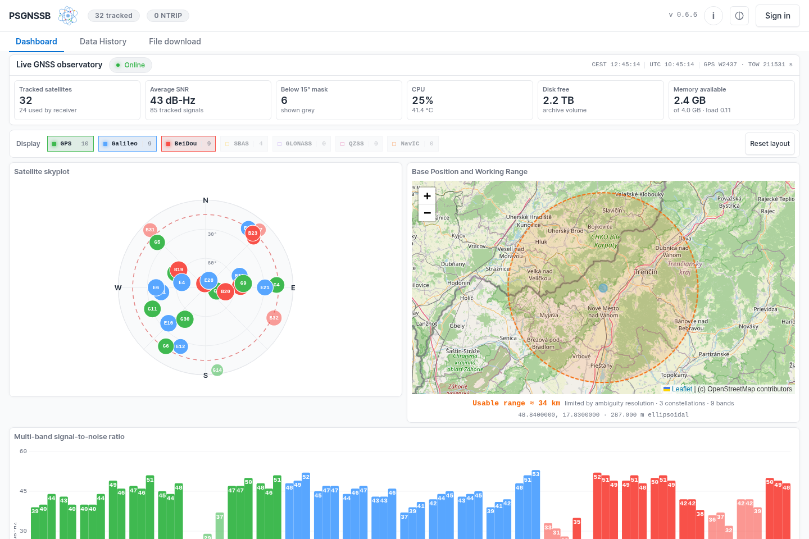

# PSGNSS

A GNSS base station in a single Go binary. It owns the receiver, serves RTK
corrections over NTRIP, records the raw stream for post-processing, and gives
you a web interface to watch it all from.



One process does everything, mostly because only one process can hold the
serial port. Everything else hangs off that: the caster, the archives, the
telemetry, the web UI.

---

## Install

```sh
curl -fsSL https://raw.githubusercontent.com/matejkrajcovic111-ctrl/psgnss-base/main/install.sh | sudo bash
```

That's the whole thing. It checks the machine, builds the daemon (fetching a
pinned Go toolchain if there isn't one, and checking its published SHA-256
first), asks you what it needs to know, writes the config and the systemd
units, and starts the service.

```
── Receiver ──────────────────────────────────────────────

Supported boards:
  simplertk4-optimum     ZED-X20P     full support
  simplertk2b            ZED-F9P      no driver yet
  simplertk3b-pro        mosaic-X5    no driver yet
  simplertk3b-budget     UM980        no driver yet

Board [simplertk4-optimum]:
Serial devices:
 * 1) /dev/serial/by-id/usb-u-blox_AG_-_www.u-blox.com_u-blox_GNSS_receiver-if00
Receiver device [1]:
```

Every question has a default in brackets, so you can hold enter through most of
it. You see the full list of files before anything gets written, and it won't
touch a station that's already set up.

If you'd rather look before you leap:

```sh
PSGNSS_ROOT=/tmp/try sudo ./install.sh   # writes a complete install to /tmp/try
sudo ./psgnssd --setup --setup-dry-run   # just prints the plan
```

You need Linux with systemd, arm64 or amd64, and a supported receiver on USB. A
Raspberry Pi 4 has plenty of headroom; the daemon sits at around 0.35% of one
core.

One thing it doesn't install is `convbin` from RTKLIB, which is what turns raw
logs into RINEX. Everything else works without it, and the installer says so at
the end.

---

## What it does

**NTRIP caster.** v1 and v2, with a sourcetable, per-user accounts, connection
limits, expiry dates, IP restrictions and per-mountpoint access. Every
connection is logged with the user, address, duration and byte count.

**Mountpoints are filters.** The receiver already emits MSM4 and MSM7 at the
same time, so serving both costs nothing and nothing gets re-encoded on the way
out. What a rover receives is what the receiver produced.

**Two archives.** The RTCM correction stream, and a navigation archive of
`RXM-SFRBX` plus `RXM-RAWX` for RINEX. Both spool to local disk and get flushed
to an SMB share continuously, so losing the share costs you disk space rather
than data.

**RINEX on demand,** over any date range including overnight spans and the
current day, with presets for IGN, NRCan and the usual 1 s and 30 s services.

**Receiver configuration** over UBX, with read-back verification and an
automatic revert. If a write isn't confirmed in time it rolls back by itself,
so you can't take the stream down from the settings page by accident.

**Ephemeris.** This receiver family can't emit RTCM 1019, 1042 or 1046 at all,
so PSGNSS builds them from the raw navigation subframes instead.

**A web UI** with a live skyplot and per-band SNR, about a week of history you
can scrub back through, plus users, mountpoints, receiver settings, diagnostics
and file downloads. Single page, everything vendored, no CDN and no build step.

There's also push-out to external casters, RTCM over UDP and serial, time to
chrony without gpsd, and a position-integrity check that re-solves the antenna
against a reference network and compares the answer with what you're
broadcasting.

---

## Day to day

```sh
systemctl status psgnss.service
journalctl -u psgnss.service -f

psgnssd --check --config /etc/psgnss/psgnss.toml
psgnssd --config /etc/psgnss/psgnss.toml --user-add rover:password:5
psgnssd --dependencies
```

The web UI is on 8090, the caster on 2101, and the raw stream is repeated on
5001 and 5003.

Back up `/etc/psgnss/secrets/master.key` somewhere other than the machine
itself. It's what makes stored NTRIP passwords readable, so a backup containing
both it and the database is effectively a list of plaintext passwords. Keep the
two apart.

---

## Updating

```sh
psgnssd --update-check
psgnssd --update
```

Releases are signed with Ed25519 and the public key is built into the binary.
Nothing updates on a schedule; `--update` is something you run.

Because this is a live base station, the updater does all its checking before
it touches anything: the signature, then the size and hash, then whether the
new binary runs, and finally whether it accepts the config you're currently
using. Only after all that does it set the old binary aside and move the new
one in. If the service doesn't come back, it puts the old one back and restarts
again. You end up on the new version or the old one, not stuck somewhere in
between.

---

## Documentation

| | |
|---|---|
| [docs/architecture.md](docs/architecture.md) | How the pieces fit together, and why they're arranged that way |
| [docs/configuration.md](docs/configuration.md) | Every setting, and what goes wrong if you get one wrong |
| [docs/operations.md](docs/operations.md) | Backups, restores, diagnosis, troubleshooting |
| [docs/hardware-notes.md](docs/hardware-notes.md) | What this hardware actually does, as measured |
| [docs/releasing.md](docs/releasing.md) | Building and signing releases |
| [CHANGELOG.md](CHANGELOG.md) | What changed |
| [CREDITS.md](CREDITS.md) | Outside work this builds on |

---

## Hardware

| Board | Receiver | State |
|---|---|---|
| ArduSimple simpleRTK4 Optimum | u-blox ZED-X20P | Full support |
| ArduSimple simpleRTK2B | u-blox ZED-F9P | Profile only, no driver |
| ArduSimple simpleRTK3B Pro | Septentrio mosaic-X5 | Profile only, no driver |
| ArduSimple simpleRTK3B Budget | Unicore UM980 | Profile only, no driver |

The three without drivers are declared but refused. The installer won't let you
pick one, since PSGNSS couldn't configure or read that receiver and you'd end
up with a station that doesn't work.

---

## Building

Go 1.24 or newer. No cgo, no C toolchain, nothing else.

```sh
make arm64      # static binary for a Pi -> dist/psgnssd-linux-arm64
make host       # for whatever you're on
make verify     # build twice and compare hashes
make test vet
```

The build is reproducible (`-trimpath`, `-buildid=`, `-buildvcs=false`,
`CGO_ENABLED=0`), so two builds of the same commit come out byte-identical.
That's what lets you check that a given binary really came from a given source
tree.

```
cmd/psgnssd        the daemon and its command-line modes
internal/hub       owns the serial port, demuxes, fans out
internal/caster    NTRIP v1/v2, sourcetable, auth, accounting
internal/receiver  UBX configuration with verification and auto-revert
internal/archive   spool, share, rotation, retention
internal/web       API and the embedded single-page UI
internal/setup     the first-run installer
internal/updater   verify, install, health-check, roll back
tools/             release signing, key database generation, a UI harness
deploy/            systemd units, if you'd rather install by hand
```

---

## Licence

AGPL-3.0-or-later. If you modify PSGNSS and let other people use it over a
network, which includes running a caster or a web UI for them, you have to
publish your changes. See [LICENSE](LICENSE).

Several features are here because
[RTKBase](https://github.com/Stefal/rtkbase) did them first and did them well,
and [RTKLIB](https://github.com/rtklibexplorer/RTKLIB) handles the RINEX
conversion and the integrity solving. No RTKBase source is copied here, but the
debt is real and the licence obligations aren't optional.
[CREDITS.md](CREDITS.md) has the details, file by file.
